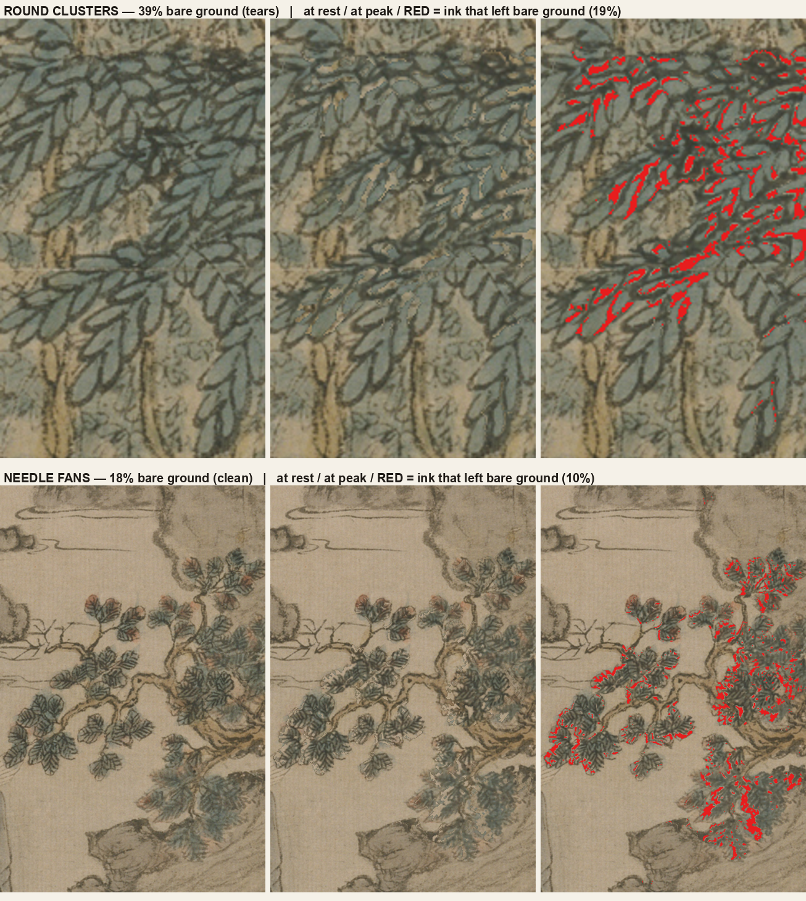
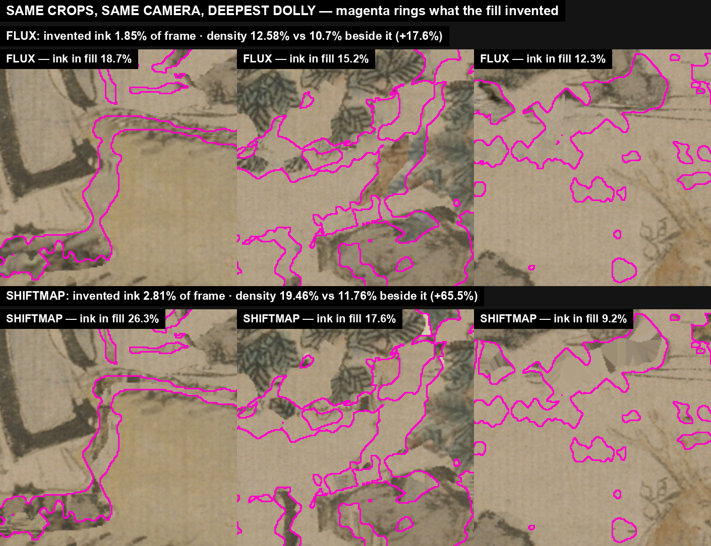

# media-tools

A toolbox of single-purpose media CLIs, and the multi-week campaign that has been
stress-testing it: **making a 14th-century Chinese scroll painting move.**

The painting is 王蒙 *葛稚川移居圖* (Wang Meng, *Ge Zhichuan Moving His Dwelling*)
— a 105-megapixel hanging scroll. The goal is a film under four minutes in which
the mountain is alive and a camera explores it, and in which **every mark that
moves is a mark Wang Meng painted.**

---

## The shape of the repo

Every media capability is ONE CLI in `tools/` (76 of them). A "lane" —
`jobs/<name>/run.sh` — is a script that composes tools. Never the other way round.

```
tools/          one job per file, no "and" in the description
  ├── generate-image.mjs      image gen        ├── animate-strokes.py   stroke cycles
  ├── restyle-image.mjs       photo → ink      ├── hinge-foliage.py     leaf cards
  ├── image-to-video.mjs      i2v / flf2v      ├── render-parallax.py   the camera
  ├── segment-points.py       SAM cutting      ├── inpaint-planes.py    disocclusion fill
  └── gpu-box.mjs             Vast rental      └── blender-multiplane.py  the new renderer

styles/         a look is a versioned ASSET (a swatch), never a prompt string
jobs/           one directory per campaign; wang-meng is the big one
knowledge/      67 typed, retrieval-tested claims — the project's memory
docs/journal/   the narrative layer, dated
archive/        superseded plans and dead ends, kept runnable
STATE.md        GENERATED from git + the store. Hand edits are destroyed.
```

**The tool contract.** Explicit I/O: inputs by flag, outputs by `--out`. Nothing
runs implicitly — a tool that needs a transcript takes `--transcript`, it never
transcribes for you. No tool invokes another tool. JSON on stdout, progress on
stderr. `--help` is the contract.

**Why it is shaped this way:** composability by humans and agents alike, and so
that a capability can be swapped without touching the lane that uses it. The full
reasoning is in `docs/specs/2026-08-11-media-tools-design.md`.

---

## The journey

388 commits over 15 days. What follows is the post-mortem — written to be read,
because the failures with their mechanisms are the most valuable entries here.
Each era is anchored to git so `git log --grep` finds the moment.

Format: **Tried → Happened → Mechanism → Verdict.**

---

### Era 1 · The toolbox, and finding the look (2026-08-11 → 08-12)

**Tried.** Build the toolbox, then find an ink-wash style by renting a GPU and
running published style LoRAs — `darkbrush`, `chinese-ink-linen-scroll` — across
six subjects on Krea-2.

**Happened.** 24 renders, technically flawless, and Ryan rejected all of them:
*"I actually don't really like these Lora's."* A second round with his own
reference images stacked on top was also rejected. Then the look he actually
loved turned out to already be in the repo.

**Mechanism.** A published style LoRA encodes **one person's taste as weights**,
and the model exposes no channel through which to supply your own. The only
control surface left is the trigger phrase, and a phrase cannot carry a look. The
route that works gives taste its own INPUT — a reference image in a dedicated
style channel. That is `uso-inkwash`: three separate channels for **style**
(a face-free swatch patching the model), **identity** (a photoreal plate on the
conditioning) and **content** (short text). Fuse them into one prompt and
changing one changes all three.

**Verdict.** LAW — a look is an ASSET, not a sentence. `styles/` stores swatches.
→ `knowledge/uso-inkwash-is-the-approved-ink-renderer.md`,
`knowledge/a-published-style-lora-is-somebody-elses-style.md`

A second finding landed the same day and reframed the whole project. Across six
i2v clips on two models, **not one output drifted to photoreal** — every failure
was *content* drift: the wrong man, invented reeds. **Style is solved; control is
the problem.** That killed the session's own plan to train a style LoRA, which
would have taught a model a look it already held.
→ `knowledge/style-is-solved-control-is-the-problem.md`

---

### Era 2 · Renting the same GPU three times (2026-08-16 → 08-18)

**Tried.** Use Voyager, a video-generation model, to fly a camera through the
painting. Three A100 rentals, roughly $9, a day and a half.

**Happened.** The model repainted whatever it touched. Verdict FAIL for museum
work — and the disqualifying fact had been free and public the whole time.

**Mechanism.** Voyager's output spec is **768×512**. The source is **105
megapixels**. No amount of pipeline work makes that a deliverable. Nobody had
written the one line comparing the model's output resolution against what the
deliverable needs, because the environment pre-flight asked *"will it run"* and
never asked *"is the result worth looking at."*

**Verdict.** LAW — **the output contract.** Before any model campaign or GPU
rent, state resolution × duration × fps against the deliverable, in one line. The
spec is on the model card, free, and can disqualify the model before any other
question matters. Enforced mechanically: `gpu-box.mjs up --rent` now **refuses**
without `--contract`. Prose laws are read; gates are executed.
→ `docs/journal/2026-08-18-voyager-gate-and-the-amnesia-fix.md`

The same day produced the second law, and it is the more important one. Ryan:
*"you are too amnesic… if it's not written down in a place that you check every
single time, it's gone."* Session context always dies. So: **evidence lands in the
repo at creation time**, and **commits happen at the moment of learning**, not at
session end. A displacement diagnostic rendered to a scratchpad two days earlier
had been argued from on screen and then evaporated with the session; only a manual
screenshot survived, provenance unrecoverable.

---

### Era 3 · Bring it to life (2026-08-20)

**Tried.** Five days of camera moves over still ink. Ken Burns pans, zigzags,
parallax flights.

**Happened.** Ryan, plainly:

> "Stop cutting corners and doing the same fucking camera pan shot… you still
> keep putting it off and showing me the same fucking zigzag Ken Burns left,
> right, camera pan."

Measured at that moment: a 31-station, 20-minute route with living cycles in
exactly **one of five zones**. Twelve stations pushed into water that did not move.

**Mechanism.** The drift is structural, so it is worth naming. Parallax is cheap,
fast, and *looks* like progress. Authoring stroke cycles is slow manual work and
is the actual deliverable. Every session therefore drifted toward the camera.

**Verdict.** LAW — **motion before camera.** Enforced, not requested:
`film/compile-flight.py` REFUSES to render a leg whose zone has no living cycles
(the LIVING GATE). Reaching for `--allow-dead-zones` to get a pretty flight out
the door *is* the violation.
→ `docs/journal/2026-08-20-bring-it-to-life.md`

The same day, the water finally moved — and taught the technique rule. A
displacement field cannot hold a trunk still, because a field displaces
everything under it, including the mass that must stay put. So **water** (thin
arcs that quiver in place, uncovering nothing) goes to `animate-strokes`, and
**foliage** (leaves that travel and reveal ground behind them) gets **cut into
rigid cards on hinges**. Two different problems that look identical in a still.
→ `knowledge/water-motion.md`, `knowledge/foliage-motion.md`

---

### Era 4 · The hammer, and naming the technique (2026-08-20 → 08-21)

**Tried.** Mask the tree canopies automatically — four canopy-mask hypotheses and
two render modes, all tuned inside `animate-strokes`.

**Happened.** All four failed. Ryan named the right technique from memory in one
sentence: *a leaf in wind is a cut-out cel on a hinge over a clean background.*

**Mechanism.** Two engines, neither of which feels like a mistake at the time:

- **A tool that RUNS is more persuasive than a tool that FITS.** A flag's
  existence reads as a claim of fitness. It is only evidence that someone once
  thought about the case.
- **Tuning has a gradient; tool-choice does not.** Inside a tool, every knob moves
  a number and changes an image — it feels like progress. Stepping out to ask
  "wrong tool?" is a discrete jump with no local signal, so the search never
  leaves the basin it started in.

**Verdict.** LAW — **name the technique before you pick the tool.** Say in one
sentence what a practitioner of the craft would DO; only that can be checked
against the problem. Two structural defences, both cheap: every tool's docstring
says what it is NOT for and names the tool that is (`tools/cut-stroke.py` opens
with a table of four other maskers and the measured reason each fails), and
`SKILL.md`'s problem table gives **one** answer per problem — it had two adjacent
rows sending one problem to two tools, wrong one listed first.

A harder finding landed beside it, and it is the one that keeps being re-derived:
**there is no whole tree to segment.** Wang Meng draws a tree as separate marks
over bare silk — leaf sprays, twigs, a trunk — with no enclosing contour. Every
automatic method therefore answers a different question than the one asked. SAM
point prompts return individual leaf *sprays*; a tone threshold bleeds through
where the tree's ink touches the rock's ink and swallows 47–64% of the crop.
**A whole-tree mask can only be AUTHORED**, because a lasso is a human judgement
about which marks are one tree, and that judgement is not in the pixels.



→ `knowledge/no-whole-tree-to-segment.md`

---

### Era 5 · Two numbers that were lying (2026-08-21 → 08-24)

**Tried.** Believe the metrics. A parallax claim, a relief gap, a percentile-based
canopy detector, a texture-statistics classifier.

**Happened.** Nearly all of them died to a control.

**Mechanism, one case each:**

- **The parallax claim** survived an hour inside fluent prose — *"the flow field
  shows genuine depth-dependent parallax"* — and died 90 seconds after being
  rendered beside a synthetic pure zoom that was flat by construction. Two
  different metrics had "proved" it; controls explained away both.
- **A percentile cannot reject a region.** A percentile is defined relative to its
  own input, so it ALWAYS returns something — give it a blank sky and it returns
  the darkest 3% of the blank sky. It can rank pixels *within* a region; it can
  never decide WHAT a region contains. Measured: the darkest-3% selector claims
  7.0% of a catalogued tree box and 6.6% of a catalogued rock box, and no
  threshold on that fraction beats always guessing the larger class. The earlier
  good result came from the authored polygon, not the rule — **testing a
  WHAT-rule only on regions that already contain the right answer cannot fail.**
- **Texture cannot separate tree from rock at distance**, because at distance
  Wang Meng's 牛毛皴 hemp-fibre strokes cover rock and forest alike. The painter
  was not drawing them differently. What separates them is plain tone.

**Verdict.** LAW — **prose hides errors; build the null before believing the
number.** A metric with a plausible story attached is not evidence. And the
corollary that resolved the whole canopy problem: **the polygon was the
classifier all along.** The authored catalogue enclosed 91.4% of the catalogued
leaf ink where the density rule handed the cutter 36.0%, discarding 60% of leaf
that had already been located.



→ `docs/journal/2026-08-24-the-polygon-was-the-classifier.md`,
`docs/journal/2026-08-24-two-numbers-that-were-lying.md`

---

### Era 6 · The memory organ (2026-08-20 → 08-25)

**Tried.** Carry discoveries across sessions in markdown files.

**Happened.** It failed repeatedly, and then failed *persuasively*, which is
worse. `jobs/wang-meng/STATE.md` reached 896 append-only lines and was three
documents sharing a filename — with two of its own numbered laws re-derived at
real cost on the last day it existed.

**Mechanism.** **Every line of markdown has the type `string`.** A law, a measured
verdict, a refuted hypothesis and somebody's Tuesday guess are the same type, so
nothing can tell them apart, nothing can check them, and nothing can retire them.
Measured elsewhere (TEPA, arXiv:2608.07429) and confirmed here: under a reversal,
append-only memory scores **0.210**, no memory at all scores **0.309**, explicit
revocation scores **0.950**. **An append-only store is worse than amnesia.**

**Verdict.** LAW — the knowledge store. `knowledge/` holds one file per claim, and
the frontmatter is a **tagged union** so the illegal states are unwritable:

```
Claim = law { text } | verdict { text, scope, evidence }
      | refuted { text, mechanism } | open { text, proven: false }
      | procedure { text, applies-when, not-when, route, sibling }
```

`conflict-key` names the QUESTION a claim answers, and **at most one live claim
may answer each question.** Superseding means moving to `archive/` and naming the
replacement — never just appending the new one.

Three layers, and only one is typed by hand:

| layer | holds | lives in | written by |
|---|---|---|---|
| **CLAIM** | a rule, a measurement, a dead end, a route | `knowledge/` | typed + retrieval-tested |
| **NARRATIVE** | what was tried and what happened | `docs/journal/` | as a story |
| **STATUS** | what exists right now | `STATE.md` | **GENERATED** from the repo |

**Typed and findable are independent problems, and only the first feels like
work.** The day retrieval testing was added, a store with **0 type violations
failed 44 of 44 real questions**. Every claim now declares `asked-as` — at least
two phrasings a *person* would type — and `check-retrieval.py` asserts each comes
back in the top 3, at write time. It regresses silently: adding six claims on
2026-08-25 shifted BM25's corpus-wide IDF and knocked `water-motion` out of the
top 3 for its own question, because the word "water" had appeared in a new claim.

→ `docs/journal/2026-08-20-retired-state-md.md`

---

## Where it stands (2026-08-25)

The film is mid-rebuild against a locked plan — `jobs/wang-meng/PLAN.md`, phases
0–5. Three things must be simultaneously true and none of them is true yet:

1. **The foliage cut is bushels, not confetti.** Today only the tree beside Ge
   Hong is cut correctly (19 cards). `s-great-trees-upper` gets 147 cards, 113 of
   which hinge on nothing.
2. **The motion is scattered, gentle and sparse** — a couple of swings, a second
   of quiet, then a smaller shuffle in a different direction. Most trees never
   move.
3. **The camera does real shot work**, with parallax that is measured rather than
   asserted.

Phase 0 is also, quietly, the disk plan. `journey/z*/living/` holds 16.3GB of
baked cycle frames and **98.5% of it is foliage** — which Phase 0 re-cuts
wholesale by changing the branch-radius basis across all 170 regions. Only
~0.3GB of water and figure cycles survives. So the cache is not something to
audit or preserve; it is something the next real piece of work overwrites. Fix
the cut, rebuild, and the disk resolves itself. (The cycles are CPU-only output
of `hinge-foliage.py` — zero torch. The *paid* artifact is the 171MB
`layers-filled` from `inpaint-planes --method flux`, which nothing here touches.)

**The open architectural call:** move the multiplane camera, parallax and cutout
work into **Blender** rather than the hand-rolled renderer. Named in this repo's
own design doc on day one — and 2,208 lines of multiplane camera, cutout rigging
and layer plumbing were hand-rolled anyway, re-implementing a free add-on. That
is the most expensive single lesson here, and it has its own law:

> **Search first. Someone has already built this.** 99.99999% of problems are
> already solved. A search costs one tool call. The alternative cost, measured on
> one project: four canopy maskers, a density detector, a percentile selector, a
> colour gate and two statistical classifiers — one of which scored *worse than
> guessing* — against a product that does the whole job in a browser, free.
>
> And **search again after failures.** Your first search runs on the vocabulary
> you had BEFORE you understood the problem. "How do I mask foliage in a painting"
> finds nothing; "interactive segmentation annotation tool" finds the answer, and
> you only earn those words by failing. **A dead end is vocabulary.**

---

## Working in this repo

```bash
# before choosing any technique — run it, don't recall it
python3 ~/.claude/knowledge/bin/find-technique.py "<your situation>"

python3 ~/.claude/knowledge/bin/check-knowledge.py    # type-check the store
python3 ~/.claude/knowledge/bin/check-retrieval.py    # is every claim findable
```

Read in this order: `CLAUDE.md` → `STATE.md` → `jobs/wang-meng/PLAN.md`.

`STATE.md` is regenerated by a Stop hook from git + the store. **Hand edits are
destroyed** — that is the only way a generated file stays generated. On its first
run it found nine reverted summit regions still registered and playing in a
shipped layer.

Four documents once competed to say what was current. They were sorted into
claim / narrative / status on 2026-08-25. **Do not create a fifth.**
