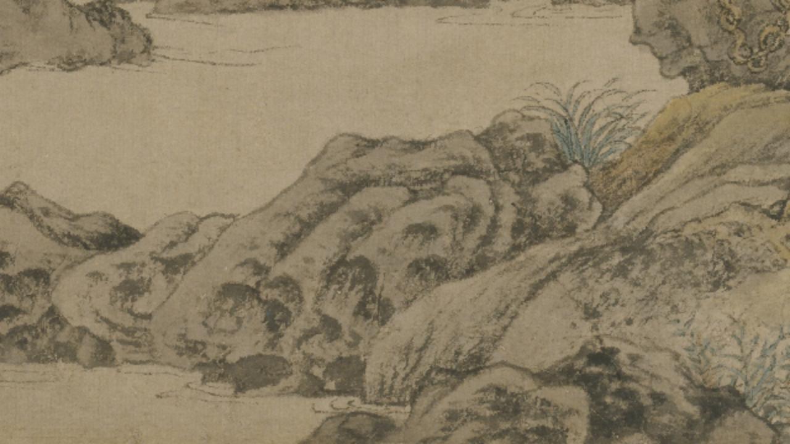
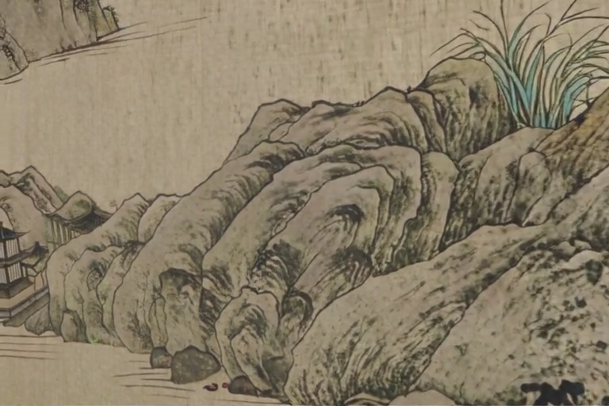
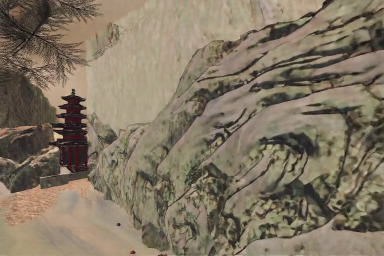
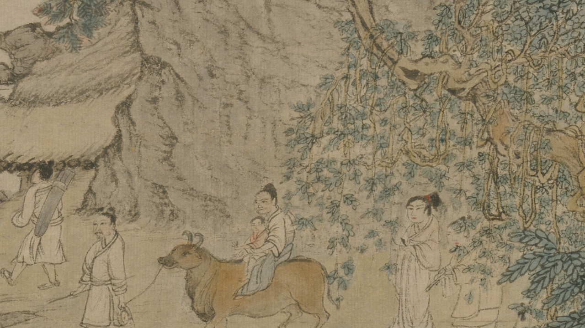
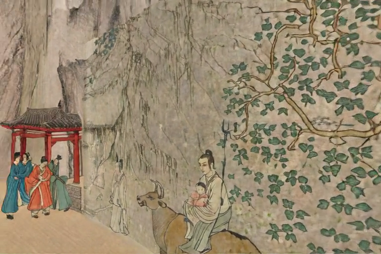

# The wild journey, and the one-generation rule

*2026-08-18, afternoon into evening · wang-meng campaign · A100 rental #4*

This morning's entry ended with the Voyager gate closed: the model repaints
whatever it touches, verdict FAIL for museum work. This afternoon Ryan asked
the opposite question: *stop fighting the repainting — what world can it push
through?* "It could take us through a wild beautiful journey." So we built one.

## The design

Ryan had already drawn the route months of dots ago: eleven stations across
the scroll, river entry to summit — Ge Zhichuan's family climbing into the
mountains. Ten chained flight segments, each one starting from the previous
segment's last frame, Voyager extending its own world. Custom trajectories
(we patched Voyager's camera generator to take arbitrary translation + gaze
vectors — every preset is just a hardcoded straight line), beat/transit speed
classes, a climb profile calibrated from figure heights in the painting itself.

And a style gate, because the morning taught us the prior is hostile: segment 1
rendered twice — "artwork" prompt vs "realistic" prompt, both against an
anti-cartoon negative prompt — Ryan picks the winner before anything chains.

## What happened

**S1 was genuinely good.** Both treatments held ink. The morning gate's
cartoon collapse turned out to be partly a prompting artifact — the gate ran
camera-only prompts; naming the medium and negating the cartoon changed
everything. Ryan: "i fw that for sure." He picked B.

| the anchor (real painting) | S1-B, end of the flight |
|---|---|
|  |  |

**S2 was the slop, immediately.** One generation of self-feeding — S2's input
was S1's output — and the game prior surfaced: a red pagoda game asset,
smoothed shading, saturation creep. Ryan called it from across the room:
*"The slop was just right around the corner. As soon as you pushed it past S1."*

| S2 (input = Voyager's own output) | S3, generation 2 |
|---|---|
|  |  |

**The one-generation rule** (the law this day forged): *Voyager holds a
painting's style for exactly one generation — while its conditions are real
pixels. The style prompt is a stabilizer, not a lock. Chained self-feeding is
a ratchet into the training prior.* The literature calls the mechanism model
collapse; Ryan's phrasing is better.

**The station-anchored retry failed on the people.** V2: every shot
generation-1 from a real crop at one of Ryan's stations, no chaining ever.
The ox-party shot held the *style* — and redrew Ge's family. New faces. An
invented red gate. Ryan: *"failed. i hate it,"* and then the sentence that
closes the book: *"way to take this beautiful piece of art and turn it into
a piece of shit."*

| the real family (input crop) | what Voyager returned |
|---|---|
|  |  |

The refined mechanism: **the repaint tax is invisible on texture and
unbearable on figures.** S1 passed because it was rocks and water. S2-v2 put
people in frame. No model that repaints can be allowed near anyone you care
about.

## Where that leaves the film

Voyager is condemned for this painting — S1-B survives as a possible cameo,
nothing more. Box destroyed, ~$7 spent today, ~$9 across the whole Voyager
question, and the question is permanently closed.

The film Ryan actually described this afternoon needs none of it: *"Some of
the best cartoons ever are not photorealistic, they're unbelievably simple…
staying true to the artwork."* Multiplane pans (the Disney 1930s machine —
our tilted cards), water and leaves moving by displacing Wang Meng's own ink
(`animate-strokes`), figures walking by stroke surgery (`walk-figure`),
occlusion teases that let you *almost* peer around a rock. Every technique
already exists in this repo, proven, local, free — and structurally incapable
of giving anyone a new face.

## Also today: the process held

Every verdict in this entry was committed within minutes of being spoken.
The SessionStart hook surfaced the morning's state into the afternoon
session; the gitignore near-miss (evidence silently ignored under `S1/`) was
caught and fixed the same hour. The amnesia fix is one day old and it already
carried a full experiment's chain of custody.
