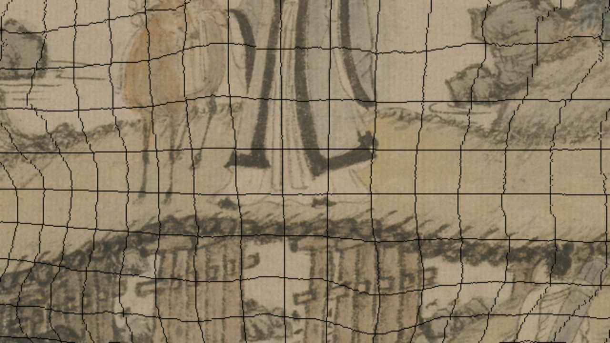

# The Voyager gate, and the day we fixed the amnesia

*2026-08-18 · wang-meng campaign · A100 rental #3*

Two stories happened today and the second one matters more than the first.

## Story one: third time renting the same GPU

Twice before, this gate test died without ever reaching the model — $2.20 spent
learning that a rented box is the most expensive possible place to discover an
environment. Attempt 3 was armed differently: every environment question answered
offline for $0 first (does the Docker tag exist, does the flash-attn wheel URL
return 200, do the repo's pins fight the box's torch), and only the GPU question
left for the GPU.

It mostly worked. Provision-to-smoke-test took 17 minutes and about forty cents.
But "mostly" is the honest word — **five more environment bugs surfaced live**,
each one caught and patched back into the committed scripts:

1. `huggingface_hub` ≥1.0 silently retired the `huggingface-cli` command — it
   prints a polite hint and exits, so the 81GB weights download *never started*
   while the script waited on a ghost. The box pulled 81GB in ~90 seconds once
   pointed at the real `hf` binary. The 15Gbps downlink was not marketing.
2. OpenCV wants `libGL.so.1` even on a headless box.
3. Something in the dependency pile dragged NumPy to 2.x; the box's cv2 binary
   was compiled against 1.x. Pin `numpy<2` *last*, after everything that upgrades it.
4. Voyager's flag is `--neg-prompt`, not `--negative-prompt`. The failure printed
   `error:` but no `Traceback` — and our log watcher was grepping for tracebacks.
   The watcher sat silent over a dead process. **Silence is not success**; every
   watcher's failure filter got widened the same hour.
5. Weights were downloaded to `/workspace/ckpts`; the model insists on
   `/root/ckpts`. One symlink.

Checkpoint B passed. These are the model's actual inputs — left, frame 0 of the
conditions, byte-faithful to the crop; right, frame 48, the camera at full depth,
where the black wireframe is the depth mesh showing through the places the
painting simply runs out of pixels. That wireframe is not damage. It is the work
order: *invent here, keep everything else.*

| conditions, frame 0 | conditions, frame 48 |
|---|---|
|  |  |

Inference is running as this entry is written — 50 denoising steps at 20s/step
on the A100, silk-survival verdict to follow against the 11% static-control
floor. Run 1 deliberately uses *none* of our authored world data; it is the
control. Run 2, if the ink holds, swaps our composed depth field in.

## Story two: "you are too amnesic"

Mid-morning, Ryan pasted a screenshot — a magenta displacement grid over the
bridge crop — and asked where it came from. The answer, after an hour of
searching the job tree, two published reports, and the surviving session
scratchpads: **nowhere**. The file had been rendered into a session scratchpad
on August 16th, opened on screen, argued from — and deleted with the session.
His manual screenshot is the only copy in existence. Its provenance is
unrecoverable.

His words: *"We're losing research and proven abilities… when I have to
inevitably clear the context, it's gone forever. You are too amnesic."* And the
sharper version: *"It's like training a new worker who forgets half of what you
taught them every day."*

He's right, and the fix cannot be a promise to remember — promises live in the
context that dies. The fix is structural, and it shipped today:

- **Evidence lands in the repo at creation time.** Law at the top of this
  repo's CLAUDE.md, in the user-global CLAUDE.md (auto-loaded into every
  session), and in the bible (§7.5, pushed). Scratchpads are for intermediates
  nobody will ever cite.
- **The gitignore was the deeper bug.** `jobs/` was blanket-ignored — the
  entire evidence record existed on one disk, untracked. Rewritten as a
  whitelist: all text, scripts, JSON, and `evidence*/` directories tracked;
  only bulk pixel intermediates stay out. 312 files entered git the same hour,
  including the salvaged flight-experiment frames rescued from a scratchpad
  that hadn't been cleaned yet.
- **Hooks, because hooks are executed, not remembered.** A SessionStart hook
  now shows every fresh session the repo's last commits, uncommitted leftovers,
  and where STATE.md lives. A Stop hook refuses to let a turn end while
  STATE.md or evidence files sit uncommitted for more than ten minutes. The
  harness rides the agent so Ryan doesn't have to.
- **This journal.** STATE.md stays the terse operational log; this directory
  is the readable record — what we tried, what broke, what it taught us, with
  the pictures inline. GitHub renders it as the story it actually was.

The full illustrated catalog of every technique in this campaign — sixteen
figures, each a real tool output, plus the gap ledger — was published today as
[The Enriched Painting](https://claude.ai/code/artifact/df599ab5-7b96-4354-b3e1-754cde599664),
with its figure sources committed under `jobs/wang-meng/evidence/atlas-2026-08-18/`.

## What today cost and bought

Box time so far ≈ $1.30. Bought: a running Voyager gate, five environment
fixes that make attempt 4 (if ever needed) a one-command affair, and — the
real purchase — a memory system with teeth.

## Postscript, 09:30 — the verdict

The gate ran, and the answer is **no**. Voyager redrew the painting — not
just the wireframe regions it was asked to invent, but every pixel including
frame 0, which its own conditions held byte-faithful. The ink became clean
cartoon linework with flat fills; Ge Hong got a new face. One genuinely
valuable finding survives the failure: **the trajectory control works.** The
camera executed exactly the push we conditioned, the composition tracked our
partial renders, and the depth channel stayed coherent. Voyager obeyed our
geometry perfectly and repainted our pixels anyway — the purest possible
demonstration that the campaign's tension (ink-holding models have no camera;
camera-controlled models have hostile priors) is a property of training
data, not of architecture. Run 2 does not fire. Gate closed at $1.40 total.

| what Voyager was given (frame 0 condition) | what it returned (frame 0 output) |
|---|---|
|  |  |

The tilted-cards path — every pixel Wang Meng's — remains the way through
the scroll.
