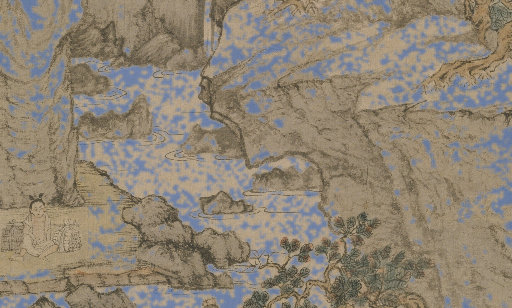
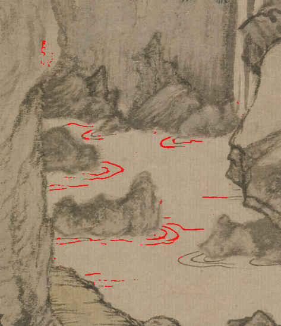
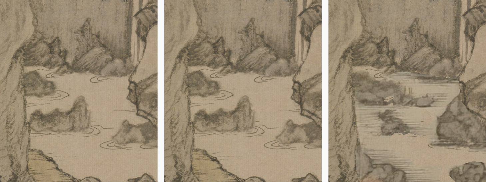
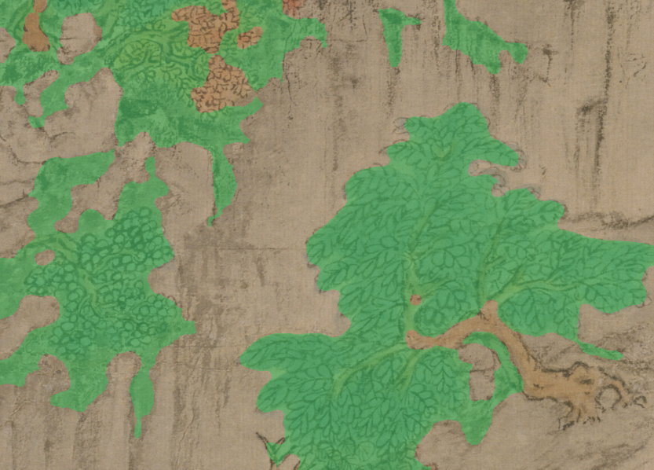
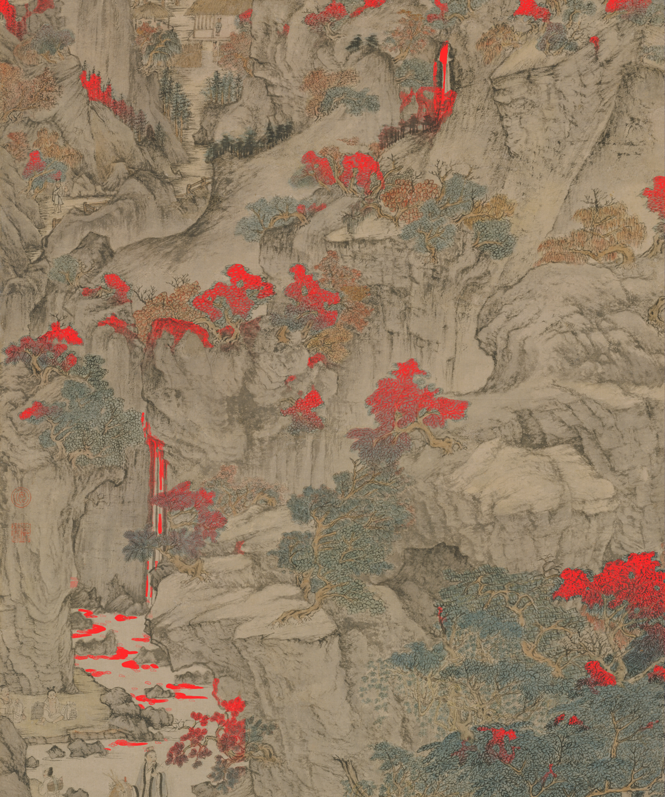

# Bring it to life — the day the water finally moved

*2026-08-20 · wang-meng · commits `2f54c75` → `6eb1c69` → `d3d8c46`*

Ryan, after five days of being shown camera moves over still ink:

> "Stop cutting corners and doing the same fucking camera pan shot. That's not
> what this is about. **Bring it to life. That is number one. Quit pushing that
> off.** … I don't know how to drill that into your skull."

He was right, and the interesting part is *why* he had to say it five times.
The drift is structural. Parallax is cheap, fast, automatable, and looks like
progress at the end of a session. Authoring motion — stroke cycles, water,
gusts — is slow manual work and *is* the deliverable. Every session took the
cheap path and reported a milestone. The measured state when he called it: a
31-station, 20-minute camera route, living cycles in exactly **one** of five
zones, and twelve stations pushing into water that did not move.

So the first commit of the day was not a feature. It was a gate.
`compile-flight.py` now refuses to render a leg whose zone has no living
cycles, and the escape hatch is named so that reaching for it is the
confession: `--allow-dead-zones`.

Then the actual work. Three things had to break before a single ripple moved,
and every one of them was found by **looking at a picture**, not at a number.

## 1. The masks were not water

`mask-bare-ground` cuts 留白 by material: bright, low-variance silk. That works
at the river, where the water is bare silk between dark banks. Above the
bridge it does not, because the dry **cliff** is also bright low-variance silk.
Here is the audited native mask for the midstream pool:

Blue confetti over dry rock. Numerically: 449 components, the largest 6,487 px,
and no pool anywhere in it. Six weeks of tooling had been pointed at the wrong
question — *what is bare silk* instead of *what is water*.

What separates water up here is pictorial, not photometric, so it gets
authored. `living/grid-crop.py` renders a labelled master crop; you read the
boundary off the grid; `living/living-polys.json` holds the polygon. The same
loop the 31 stations were authored with.

Two entries in the region inventory died while looking. `f-left-tall-fall` is
bare cliff and canopy. `w-upper-stream` is not a stream. Both names point at
the same thing: a slender fall at x≈1470–1610 running y 9040–10620, four white
threads between dark ink lines, with pine branches crossing it twice.

## 2. The ink rule dropped every ripple

With a correct mask, the first render came out **pixel-identical to the
plate**. `animate-strokes --keep thin` asks whether a connected *component* is
thin, which is true only while strokes are isolated. In this pool every ripple
arc curls around a rock and touches it, so arcs and rocks label as one object:
70,330 ink px in 46 components, two of which held nearly all of it, and the
thin rule kept 683 px — rock rims, not one arc.

Thinness is a property of **shape**, not of a label. A mass survives a
morphological opening by a disk of `max-thick`; a line does not. Remove the
mass and a one-disk collar around it and what remains is stroke. That is
`--keep tophat`, and on the same crop it returns 2,035 px:

## 3. The loop did not close

The wave field's cross-current chop carried `1.7 * t` — 1.7 turns of phase per
cycle — under a comment asserting the field was "periodic in the cycle by
construction". It was not. Measured across the five water bodies, the wrap step
ran 1.4–1.7× the largest ordinary step between drawings: a visible tick every
three seconds. `2.0 * t` keeps the same second-harmonic chop and closes the
loop. Seam over max-step is now 0.53–0.96 everywhere.

## The one that would have shipped garbage

The plane textures in `layers-filled` are real painting only where nothing
nearer covers them. Everywhere else they are disocclusion fill. Over the
midstream pool, `left-cliff-wall`'s fill is smeared streaks where the ripple
arcs used to be — invisible at rest, because a nearer plane is painted over it.

The first build animated that. So the construction changed: animate the
**plate** once per water body — one continuous travelling wave across every
plane seam that crosses it — then split the drawings into per-plane patches by
**visibility**, so each water pixel is animated by the plane that actually
shows it.

## Foliage: the canopy is found by texture

Colour cannot cut a canopy out of this painting, and that is measured three
ways now: 0.9% of leaf ink is green or cyan, cliff ink is *more* saturated than
leaf ink, and in Lab the compound canopies sit 1–3 units from bare cliff on
both a and b. Texture can. A leaf mass is a dense field of repeated dot and
outline strokes; a 皴 cliff is sparse hatching. Local ink density finds the
canopies —

— but density alone, run over the whole plate, claims 36% of the painting,
because a shadowed cliff face is also a lot of ink. The second term is
compactness: boundary-per-ink is 0.25–0.47 for leaf mass against 1.14 for
cliff wash and 1.37 for bare cliff. Leaves are a solid body of ink; a cliff is
many separate strokes.

Two details are the difference between foliage and a decal. The authored box is
grown by 120 px for the density read and components are kept by centroid, so a
canopy straddling the edge comes out whole instead of sliced along a straight
line a warp would tear. And **each canopy is its own unit with its own pivot**
at the foot of its own mass — swinging six trees about one distant pivot is the
bodily-slide tell the sway field exists to avoid.

The envelope is the one proven on the z1 pine in July: a gust as an *event*
that sweeps through and leaves calm air, which is Ryan's brief — foliage not
constantly moving, little gusts blowing through.

## What it looks like, with a real null

5.55% of the zone is alive, and it is all leaf mass, water and falls. No cliff,
no buildings, no figures.

The clip is `jobs/wang-meng/living/WATER-ALIVE-AB.mp4`: still-camera holds,
static on the left, living on the right. **The camera does not move in any of
them.** The static half drifts 0.0000 between frames — the control is a true
null, not a nearly-still approximation — while the living half moves 0.05–0.19
and 0.69–2.85% of the frame.

## What this taught that transfers

- **A mask built for one part of a picture is a hypothesis about the rest.**
  `mask-bare-ground` was proven at the river and assumed everywhere above it.
  The audit that would have caught it — tint the mask, open the file — costs
  ten seconds.
- **When a tool's own comment asserts a property, test the property.** "Periodic
  by construction" survived a month because nobody diffed the last drawing
  against the first.
- **Per-component rules are fragile at contact points.** Thin/thick, near/far,
  leaf/cliff — the moment two things touch, the label merges and the rule
  inverts. Ask by shape instead.
