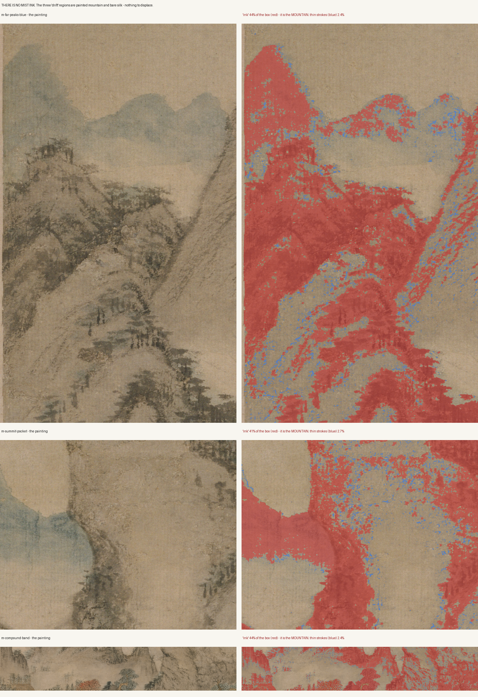
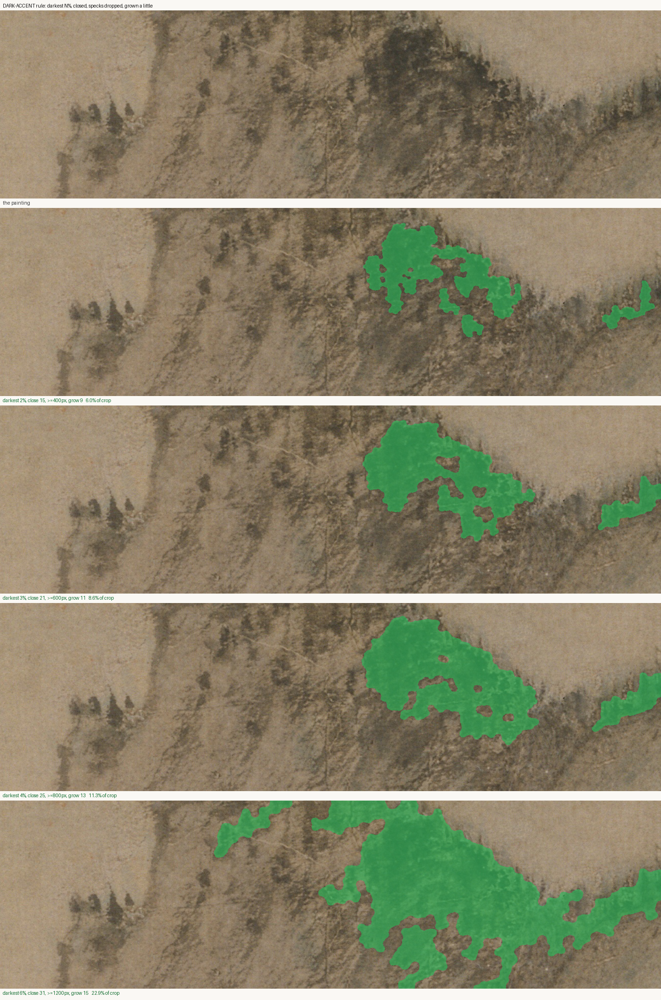
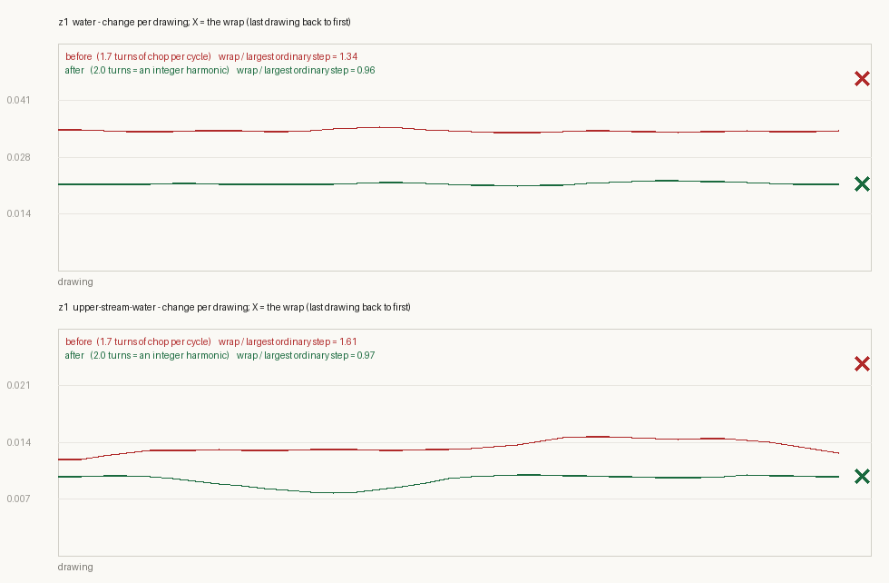

# The summits, and the mist that was not there

*2026-08-20 · wang-meng · same day as [Bring it to life](2026-08-20-bring-it-to-life.md), later*

The living layer had reached the top of the gorge and stopped. Everything
above master y≈3850 — the summits, the far ridges, the pale band over the
compound — was still a photograph. That band is exactly what the highest
camera stations frame, so the film's widest, most establishing shots were the
deadest ones in it.

The inventory already had a plan for that band: three `drift` regions, class
notes reading *"mist — UNPROVEN, control-first, cut from v1 if it smears."*
This session cut it from v1. Not because it smeared, but because it could not
have worked at all.

## Mist is not made of ink

`animate-strokes` displaces ink. So the first question is whether the three
mist boxes contain any. Measured across all three:

| region | "ink" fraction | max stroke thickness | thin stroke |
|---|---|---|---|
| m-far-peaks-blue | 40.3% | 59 px | 2.4% |
| m-summit-pocket | 37.5% | 61 px | 2.7% |
| m-compound-band | 40.0% | 75 px | 2.4% |

Forty percent ink, and a 60–75 px maximum thickness. That is not vapour. That
is the **mountain**. The picture says it faster than the table does:

Red is what the ink threshold claims; blue is the thin stroke inside it.
Displacing the red wobbles the silhouette of a mountain — precisely the smear
the inventory was worried about, arrived at from the opposite direction.

The mist in this scroll is **留白**: bare silk, negative space, the void
between ridges. There is no mark to move. An atmospheric mist *card* — the
Old Mill technique, a translucent band drifting on its own plane — would read
beautifully, and it is now the open question on the table, because it puts
material on screen that Wang Meng did not paint. That is a fabrication
decision, and fabrication is the one thing this project sells itself on not
doing. It waits for a verdict.

**Verdict: `drift` retired as an ink effect. The mist card is open.**

## What is actually up there is foliage

Having killed the plan, the band still needed life, and the obvious answer had
been sitting in the crops the whole time: the summits are covered in trees.
Crest ribbons of 苔點 dots, pines on the shoulders, a big dark dome below the
main ridge. Foliage is a solved problem here — gusts, proven on the z1 pine
back in the morning.

Distance needed one adjustment. Aerial perspective is normally a statement
about tone, but it applies to **motion** as well: a ridge two valleys back
cannot swing as far per frame as the pine leaning over Ge Hong at the bridge.
So `gust-far` is `gust` at half amplitude — wobble 3→1.5, push 2.5→1.2 — with
a slower front, travel 1500→2600. The far ridges breathe; they do not wave.

## The canopy detector does not survive the trip up the scroll

This is the part worth keeping.

The read that finds the compound canopies is local ink **density** AND ink
**compactness** inside an authored box. It was measured, it was defended
against three colour-based alternatives, and it works. Pointed at a summit
crest, it claimed **36–46% of the box** — the entire ridge shoulder, rock and
all.

Three fixes were tried. All three failed, and the failures are the finding:

| hypothesis | mechanism it assumed | result |
|---|---|---|
| the window is too big for a thin tree ribbon | scale mismatch | still the whole shoulder |
| a dark **wash** is being read as canopy — high-pass it | trees are high-frequency, wash is smooth | 0.64% → 0.63% of plate. No effect. |
| run the whole read at master resolution instead of the 2.34× plate | analysis resolution must match feature size | 45.9% of the crop. No better. |
| local contrast at master resolution | dots are discrete marks against silk | 44.8% → 29%. Still the shoulder. |

Every one of those is a texture statistic, and they all fail for the same
reason: **up here Wang Meng's 牛毛皴 covers rock and forest alike.** The
shoulder genuinely is a dense, compact, high-contrast field of ink. There is
no local texture measurement that separates a hemp-fibre cliff from a stand of
trees at that distance, because at that distance the painter was not drawing
them differently.

What separates them is plain tone. Wang Meng paints distant trees as **the
darkest accents on a mid-tone slope**. The diagnostic that ended the guessing
was the cheapest one available — just show where the darkest N% of the box
lands:

Darkest 2–3%, closed into coherent masses, specks dropped, grown a little for
the warp's feather. It lands on the tree crowns and the crest ribbon and
nowhere else. One region went from 71,580 px of "canopy" to 11,615.

`canopyRule: "dark-accent"` is now selectable per class in `regions.json`.
The compound's rule is untouched and the four built zones do not move — a
distance-dependent rule, chosen by the region's own class, rather than a
retune that would have regressed everything already verified.

**Mechanism to carry forward: a mask rule proven on one part of a picture is a
hypothesis about the rest of it.** This is the second time that exact sentence
has been earned in two days — the first was the water masks, where
`mask-bare-ground` found bright low-variance silk and handed back dry cliff.
Both times the fix was the same shape: stop tuning the general rule, and let
the region say which rule applies to it.

## The loop that had been popping since the beginning

Unrelated, found while auditing: the non-integer harmonic fixed in the wave
field yesterday was still baked into z1's shipped textures, which were built
before the fix. Wrap step against largest ordinary step: **1.34** on `water`,
**1.61** on `upper-stream-water`. A visible pop once per three-second loop, in
the only zone that had any life in it at all.

Rebuilt: 0.96 and 0.97. The X is the wrap; a closed loop puts it inside the
band of ordinary steps.

Two things worth noting about how that was caught and fixed. First, the sway
cycles were checked too and were fine (pine 0.81, pine-gust 0.05, fan 0.85) —
the defect was scoped to the wave field, and saying so is what made the fix
two cycles instead of six. Second, closing the loop also removed ~38% of the
frame-to-frame change: 1.7 turns of spurious phase was *doing* something, and
the water is now calmer than the version Ryan has been looking at. That is a
look change hiding inside a correctness fix, and it gets reported as one.

*Tools added: `living/seam.py` (wrap-vs-ordinary-step for any drawings dir),
`living/plot-seam.py`, `living/ab-loop.py` (A/B played through three wraps,
because a pop happens once per cycle and never in a single pass).*
