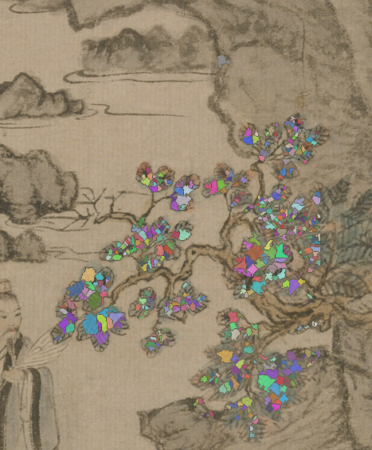
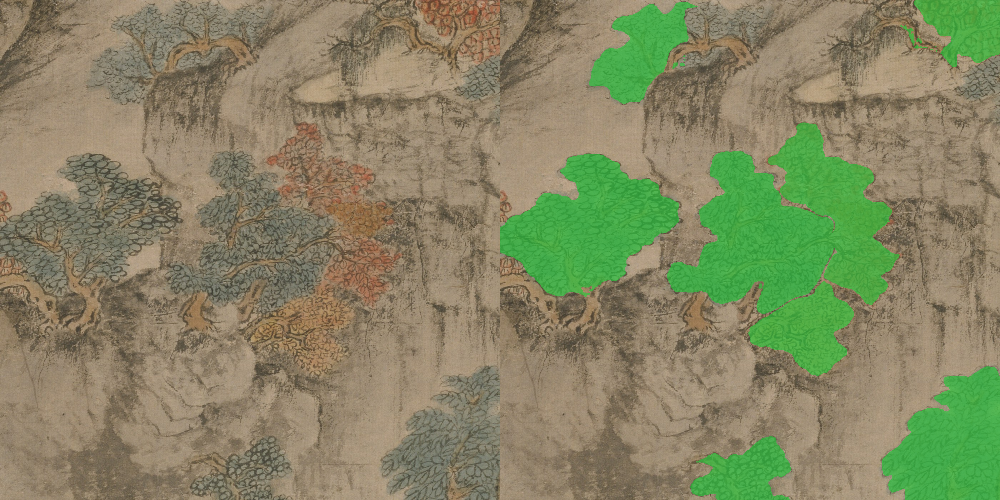

# The ladder was the wrong question

*2026-08-21. Ryan settled a pending verdict in one character — "12" — and then,
in the next sentence, made the verdict beside the point.*

---

## Tried: a swing ladder

Yesterday's reel came back with three complaints. Two were mine to fix and I
fixed them: the rock was being animated, and every leg sat at the same fov with
`z = 0`. The third was *"I don't know if you were trying to animate much of the
leaves, but that was not very impressive."*

I had a good answer for that one. Rather than nudge the number I built
`swing-ladder.sh` — rebuild one region at 6°, 12° and 20°, render the same hold
for each, stack them left to right — because an amplitude is a thing to see at
the real framing, not a number to guess at. I also converted the angle into
pixels for the first time, which nobody had ever done: at 6° the pine's tips
travelled **9 px**, about half a percent of frame width. So of course it was not
impressive.

## Happened: he picked a number and then named the real defect

> "12. Okay, but I see the entire leaf structure is one green blob. I would like
> to make the individual leaves kind of twinkle and shake. move around leaf not
> entire tree."

Three rungs of that ladder were three sizes of the same defect. No value on it
was ever going to be right.

## Mechanism: a rigid body has one degree of freedom

`hinge-foliage` cut cards as **connected components of ink**. Wang Meng draws
each leaf as its own mark, but the marks in a spray *touch* — so the whole spray
came back as one component, one card, one pivot. A rigid body on a hinge has
exactly one degree of freedom. However you tune the angle it can only tilt.
Shimmer was not a smaller tilt I had failed to dial in; it was a motion the rig
could not express at all.

The technique I should have named first: in cel practice a canopy carries **two
scales at once** — the spray swings on its branch (primary), and each leaf moves
smaller, faster and out of phase with its neighbours (*secondary action*). The
flash a real canopy gives off is a leaf turning **edge-on**, which for a flat
ink mark is a narrowing along one axis. Rotation alone reads as wobble; the
narrowing is what reads as light.

The atoms were already in the ink. They only had to be separated — and touching
blobs of similar size are separated by **distance-transform watershed**, the
classical routine for splitting touching cells or coins. Seed spacing is read
from the ink itself (the median distance-transform value over a card's ink *is*
the typical mark half-width), by exactly the mechanism that made `branchRadius`
auto a week ago: Wang Meng paints leaves at near-constant real size, so a distant
tree is the same drawing with smaller marks, and one fixed spacing splits one
tree while fusing the next.

306 cards became **2,853 leaf marks** across z3w's seven near trees, at no
measurable cost — 4.5 s rendered both halves of the A/B. The honest outlier is
`s-right-rust-tree`: 13 cards, 40 marks, the smallest leaves in the zone. That
is the one tree where the blob critique may still stand.

## Verdict: rejected, four hours later

I recorded a verdict — `leaf-marks-are-the-second-scale` — and routed
`foliage-motion` through it. Then Ryan watched the rebuilt reel:

> "This new method of cutting out the leaves is a little too aggressive. It
> deforms the aesthetic. What we had before was actually looking good. I think if
> we just cut out little chunks, bushels of branches, and wave those around, like
> how we were doing before, that's a better method."

**And the reasoning had not been wrong.** A real canopy does carry two scales of
motion. Secondary action *is* why foliage shimmers. The watershed found the atoms
cleanly — 433 marks from 21 cards. Every step was sound, and the output was still
rejected, for a reason that outranks all of it:

**A card is a rigid transform.** Every brushstroke inside it arrives at the new
position unchanged — same ink, same taper, same dry-brush edge, just somewhere
else. Rotating and narrowing each mark deforms each stroke individually. That is
not animating the painting. It is **redrawing** it, several times a second, in a
hand that is not Wang Meng's.

The goal was never a physically plausible tree. The goal is this painting, in
motion, still looking painted by the person who painted it. **Fidelity to the
medium beats fidelity to the physics.** A cel animator cutting a tree out of a
background painting cuts *along the branches* for exactly this reason — the cut
is free, the redraw is not.

So the unit of motion is the **bushel**: a chunk of branch with its leaves on,
big enough to carry its brushwork intact, small enough that neighbours can move
out of phase. Nothing below the card is ours to move.

`leaf-marks-are-the-second-scale` is in `knowledge/archive/`, superseded by
`rigid-cards-preserve-the-brushwork`. `--leaf-marks` stays in the tool as an
off-by-default flag whose docstring now records what it is *not* for.

**What I still think is true from the dead end:** when tuning a parameter
produces only bigger and smaller versions of the same complaint, the missing
thing is a degree of freedom, not a value. That got me to build the right
mechanism. It just did not tell me whether the mechanism belonged here — and no
amount of animation theory could have, because the answer lives in the medium,
not in the motion.

---

## The store caught itself

Writing that claim broke something, and the store said so before I noticed.
`check-retrieval` reported `foliage-motion` **unfindable** for its own defining
question, *"make the leaves move"* — the query returned the two new claims about
leaves instead of the route.

The cause was one of our own laws. `foliage-motion` was carrying forty lines of
narrative: six parameter passes, Laplacian variance numbers, the `INPAINT_TELEA`
diagnosis. All true, all worth keeping, none of it a *rule* — and BM25 normalises
by length, so **a claim carrying its own history loses to anything shorter on the
same subject.**

`three-layers-claim-narrative-status` has said a file mixing CLAIM and NARRATIVE
rots. This is the first time the rot was *measured* rather than argued, and the
cost was not confusion — it was a working procedure becoming unfindable at the
exact moment a second claim about the same subject was written. The trace moved
to its own journal file; the claim kept the route.

---

## And: have the model label everything

Ryan, on the colour heuristics: *"You should be embarrassed that I'm pointing
out something so obvious… We should have an AI model label everything for us."*

He was right, and my first attempt at it was wrong in an instructive way. I fed
SAM the CLIPSeg confidence blobs — and every mask came back filling **59–96% of
its own prompt box**, which is SAM answering *"the cliff"*. Prompted instead with
**labelled per-tree boxes** from a VLM catalogue, every mask came back at
**37–63% fill, IoU ≥ 0.96**, hugging the canopy and stopping at the rock.

The model was never the problem. A confidence blob has no vocabulary and no
object identity, so refining it produces a well-shaped wrong answer.

So I labelled all sixteen z3w tiles: **136 objects** — 73 tree, 31 rock, 9
figure, 8 water, 6 trunk, 2 building, 2 structure, 1 seal. The distinctions no
threshold can make are the point:

- **trunk ≠ tree** — a trunk is the anchor a canopy hinges above, never a card
- **seal** — two vermilion collector seals sit *on* the silk, and red is exactly
  what a maple colour gate hunts for
- **`leavesVisible: false`** — distant conifer *rows* are marks, not trees
- **Ge Hong himself** is in t000, and the whole 移居 — a child minding caged
  birds, porters, a gentleman with a fan — is in t012

Three red passages are typed `unknown` on purpose: at tile resolution I cannot
tell a red-robed figure from a maple, and a figure wants a robe cycle while a
maple wants leaf cards. Guessing would be visible.
