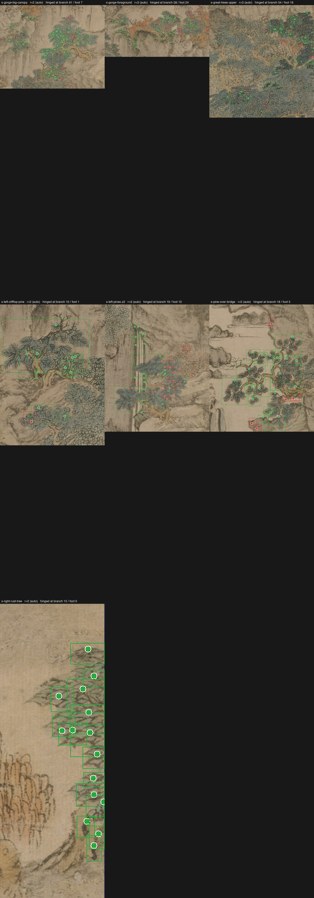

# 2026-08-21 — the radius was in the wrong units

## First, the store got tested

Ryan: *"I want to see how well the new store works."* Fourteen questions typed
the way he would type them, none of them in any claim's `asked-as`:

| test | result |
|---|---|
| 13 domain questions, unseen phrasings | 13/13 right claim at rank 1 |
| 3 universal laws reached from inside the project | 3/3 |
| the 3 archived claims' own questions (the reversal test) | live claim only, every time |
| "how to make bread" | **two laws printed at score 0.0, styled as answers** |
| gates run with cwd inside `~/.claude` | **22 false violations** — the universal store counted twice |

Both fixed in `claude-knowledge` `afb6230`. A zero score now says NO CLAIM
ANSWERS THIS in words. The point of the store is that a wrong answer cannot
look like a right one; a null query dressed as advice was the same failure
in a new coat.

## Then Ge Hong

**Tried.** Settle the one pending verdict — branch radius and stir on the pine
over the bridge — and roll the hinge rig out to the other six near trees.

**Happened, in order.**

1. Ryan looked at `evidence-attachment-pivot.png` and `AB-HOLD-pinebridge.mp4`
   and said "looks good". Verdict recorded: radius 5.
2. The builder had never passed `--branch-radius`. Every zone build after the
   attachment fix had used the tool default, 3, while the evidence image showed
   5. Fixed: the `foliage` class in `regions.json` carries the number, the
   builder reads it (`87eb324`).
3. `cycle.json` did not record the radius either, and the builder swallows
   the tool's stderr, so nothing on disk could say which rig made a build. Now
   it records `branchRadius`, `attachMax`, `cardsAttached`, `cardsFoot`. While
   in there: card seeds came from `hash(name)`, which Python salts per process,
   so two runs with identical flags had different gust phases. `crc32` now
   (`d802f66`).
4. The first rebuild's record showed the real problem at once:

       pine over bridge     18/23 cards hinged at a branch
       great trees upper    19/70
       left pines           4/29
       gorge big canopy     1/68

   Everything but the pine had fallen back to the foot pivot Ryan had rejected.
   `evidence-branch-radius-sweep.json` swept r=2..7 on all seven trees;
   `measure-stroke-width.py` measured each tree's thickest stroke.

5. `AB-HOLD-pinebridge.mp4` was timestamped 16:51 and the attachment rig
   landed at 18:07. The clip Ryan approved was the foot pivot at 6°. I
   overwrote it with the attachment rig and called that "the approved thing,
   rendered properly". Ryan: *"The first one you showed me this morning looked
   better… Didn't you just show me a B hold Pine Bridge before we started?"*
   Restored from `5cc32e8`, both rigs kept by name, and cut side by side
   (`AB-PINEBRIDGE-foot-vs-attach.mp4`). Ryan: **"The right one is slightly
   better."** Attachment wins — narrowly, and on a motion A/B for the first
   time. The still overlay had never been the proof.

**Mechanism.** Wang Meng paints a tree at near-constant real size, so a tree
further up the scroll is the same drawing made smaller, with thinner strokes.
The pine's 99th-percentile stroke half-width is 9.17 px; the other six trees
are 3.3–6.1 px. An opening by radius 5 keeps only ink at least 10 px wide, and
the smaller trees have none — they have no branch to hinge on. The defect was
never the number; it was the **unit**. Ryan's 5 is 0.55 × the pine's 9.17.

**Verdict.** `hinge-foliage --branch-radius auto` = 0.55 × the tree's own p99
stroke half-width. The pine still gets 5; the big canopy gets 2 and goes from
1/68 to 61/68 attached. Claim: `branch-radius-scales-with-the-tree`. The
attached count cannot tell a pivot at a twig from a pivot inside a leaf blob
(the rust tree is 15/15 green at r=2 and every dot sits mid-blob), so the
builder now writes `pivots.png` per tree and `pivot-sheet.py` stitches them:

**Two lessons that transfer.**

- *A verdict is a hypothesis about everything else.* Radius 5 was proven on one
  tree and rolled out as a constant. The first build's own record refuted it
  in under a minute — which is the argument for recording the rig in the
  artifact, not in the log.
- *A still overlay is a claim about where a card WILL pivot. Only the clip is
  evidence of how it moves.* The attachment rig ran for a whole evening on the
  strength of a picture of dots; the comparison that justified it was made
  this morning, and it came out "slightly".
