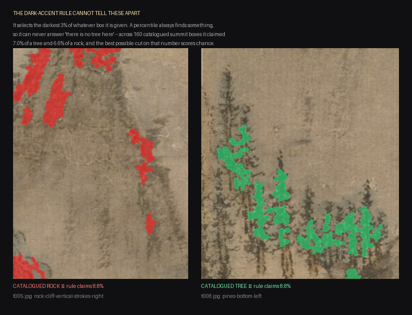

# The polygon was the classifier

*2026-08-24 — media-tools / jobs/wang-meng*

The day started with Ryan pointing at a reel and saying *"unfortunately the rock
moves."* It ended with every leg of the film rebuilt against a catalogue, three
manifest bugs of the same shape found and gated, and one live claim retired
because it turned out never to have been doing its job.

---

## Era: a threshold decided what a leaf was, and it was wrong

**Tried:** deciding foliage by colour — green is Lab `a` below the silk median,
orange is hue ≤ 28° at saturation ≥ 0.34, both on mid-tone wash.

**Happened:** run over the whole z1 plate it cut 1,243 cards and the foreground
boulders swayed. Ryan: *"we need a better way to id the foliage. there are ai
models that do this. you yourself know the dif. we can do much better. this is a
solved problem."* Then, on being offered another model: *"What about instead of
running another model. We just create a sub-agent that properly labels
everything in this painting. Cleanly, mathematically."*

**Mechanism:** the classes are DRAWN, not photographed. Wang Meng's 牛毛皴
hemp-fibre strokes cover rock and forest alike, so no local texture statistic
separates them; and the pigments are shared — the far peaks carry a blue wash and
are stone, the thatched roofs carry the trunks' ochre, the pure-ink pine stands
carry no wash at all. A colour rule fails in **both** directions on the same
painting.

**Verdict — law.** `the-catalogue-decides-what-is-foliage`. The chain is a
division of labour and none of the three parts can do another's job:
**something that looked at the picture says WHAT · SAM says exactly WHERE · the
ink cut says WHICH pixels.**

---

## Era: the summits, where the film had been a slideshow

Master y 0–4712 — 30% of the scroll and the stretch the film ends on — had never
been catalogued. The measurement that made it urgent:

    zone   coverage of catalogued leaf ink that actually moves
    z6w                0.3%

**Mechanism:** not a rendering failure. Nothing up there had ever been a
*region*, so there was nothing to animate. 0.3% is a camera move over a still
image, which is exactly what MOTION BEFORE CAMERA exists to forbid. Its leak
score of 17 px looked excellent and meant nothing — **a layer that animates
nothing cannot leak.**

Four sub-agents catalogued the band's 12 tiles: 225 objects, 123 leaf masses.
All four independently reported the same thing, which is the most useful finding
of the day:

> At summit distance a tree is ONE GLYPH — a short dark vertical trunk stroke
> under a flat dotted crown. 点苔 moss dotting is the identical mark WITHOUT the
> trunk, chained along a rock fold. **Wood is the only separator that survives.**

They also named the decoys, each verified by re-cropping the master at 1:1
rather than judging from a 1400px tile: t005's summit dome under a broad flat
石青 mineral wash, the *same pigment family as the canopies*; t001's vermilion
collector's seal, the loudest chroma in the top row, stamped across sky and rock
alike; the colophon calligraphy, the blackest ink in its tile, reaching down into
the vertical range of a real treeline.

**Verdict:** all five legs rebuilt through the catalogue.

    zone   coverage before -> after     foliage ink moving off leaf
    z1        6.9%  ->  25.8%                    632
    z3w      12.5%  ->  21.5%           9,434 -> 1,273
    z4w       8.7%  ->  18.5%           5,946 -> 1,718
    z5w       3.9%  ->  15.5%             800 ->   262
    z6w       0.3%  ->  16.7%              17 ->   723

---

## Era: the control that retired a claim

`canopy-read-distant` had been live since 2026-08-20: at summit distance Wang
Meng paints trees as the darkest accents on a mid-tone slope, so take the
darkest 2–3% of a region. Its evidence was one region shrinking from 71,580 px
of claimed canopy to 11,615 px.

**Tried:** the control it never had — hand the same rule a box the catalogue
calls ROCK and compare.

**Happened:**

    catalogued TREE boxes   n=99   darkest-3% claims  median 7.0%
    catalogued ROCK boxes   n=61   darkest-3% claims  median 6.6%

    best possible single threshold on that fraction         61.9%
    accuracy of always guessing the larger class            61.9%

**Mechanism:** a percentile is defined relative to its own input, so it ALWAYS
returns something — give it a blank sky and it returns the darkest 3% of the
blank sky. It can rank pixels inside a region; it can never reject one. So it
cannot be what decides WHAT a region contains. The 71,580 → 11,615 result was
real and was **the authored polygon working**, not the rule: inside a boundary a
human drew around a tree, any dark-ink selector looks like a tree-finder.
Testing a WHAT-rule only on regions that already contain the right answer cannot
fail, which is why it never did.

**Verdict — refuted.** `a-percentile-cannot-reject-a-region`, archived with
`supersedes`.

---

## Era: three manifests that disagreed with the disk

The same bug three times in one day, in three unrelated places:

1. **A mask index listed 17 regions while 4 of the files existed.** It already
   self-healed against the *config* — dropping regions no longer authored — and
   never checked the *directory*. The build died on the first ghost.
2. **A build manifest registered 64 patches whose frames a later re-cut had
   wiped.** `built.json` appends across runs, so nothing removed them. The
   failure surfaced minutes later as a `FileNotFoundError` inside the renderer,
   with nothing naming the stage that was skipped.
3. **A derived mask was the union of three inputs, produced by a command typed
   once at a prompt.** A fourth band would silently not have been in it.

**Mechanism:** the write is the one moment the record and the reality agree.
Every later divergence happens somewhere else entirely — a cleanup, a re-run, a
gitignore, another tool — so the manifest is correct whenever anybody thinks to
check it, and the error surfaces at the first consumer that dereferences a stale
entry, arbitrarily far from the cause.

**Verdict — law**, written to the UNIVERSAL store because none of it is about
this painting: `a-manifest-must-reconcile-with-the-filesystem`. Reconcile at the
READ, name what was dropped, name the step that would produce it.

---

## Two guards that had been written down and never enforced

**The fence.** `refine-mask-sam` has recorded `fillOfBox` since it was written,
under a comment reading *"SAM asked with a box around a canopy sometimes answers
with the CLIFF the canopy sits on… let the caller drop it."* No caller ever did.
On the summit band two tiles came back with masks LARGER than their own prompt
box — t007 at 1.629× — and clipping removed 319,513 px that had escaped a
boundary a human drew. **A diagnostic nobody acts on costs its own measurement
and prevents nothing.**

**The dedup.** `catalogue-to-polys` dedups by IoU within a run but appended to
the poly file on an **id** check alone. This session converted the z3w band under
a new prefix without checking it had already been converted, and all 80 polys —
exact coordinate duplicates — went straight through. z3w then cut 115 cycles
with two sets of cards hinging against each other on the same canopies, the
precise failure that script's own docstring warns about. `--apply` now compares
geometry against the file it writes into and names the poly each clash hits.

---

## What the day cost, and what it is worth

Everything above is a correction. Nothing new was invented — the catalogue chain
existed, the fence existed as a comment, the coverage measurement existed. What
changed is that each one now decides something instead of merely reporting it.

The one number worth remembering: **z6w went from 0.3% to 16.7%.** The film's
final minute had been a pan across a photograph.
