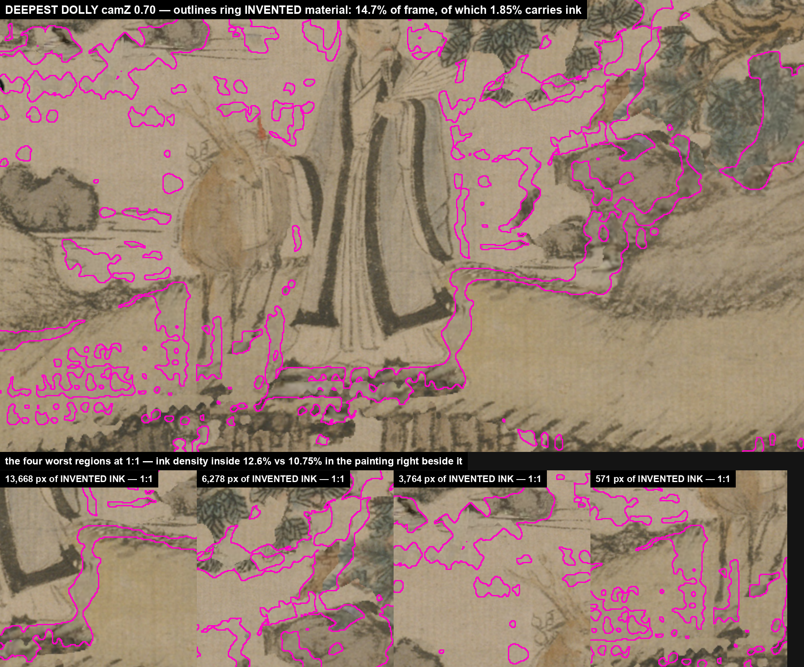

# Two numbers that were lying, and one picture that was worse

*2026-08-24 — media-tools / jobs/wang-meng*

A short session, entirely spent correcting things this repo had told itself.

## The relief gap that was never there

`STATE.md` had been reporting **31 of 74 planes = 42% relief coverage** for two
days, under a warning that `journey/build-zone.sh` "has no relief step, so the
six zones built after the verdict never got it."

Both halves were false by the time anyone read them. The relief step was wired
into `build-zone.sh` on 2026-08-22 (`f6e80a6`) and all seven zones were rebuilt
through it the same night (`8151dad`). And 74 was never the target: `build-relief`
only ever touches SURFACE planes — water, figures, architecture and foliage are
excluded by construction, which is the whole point of its `role()` classifier.

**Tried:** reading the generated status as ground truth.
**Happened:** a hardcoded warning string outlived the bug it described, and a
percentage divided by the wrong denominator invented a 58-point gap.
**Mechanism:** the status block carried its own copy of the question "which
planes count" — a second source of truth for a fact `build-relief.py` already
owns. It could not track a change in the tool because it was never reading the
tool. The warning was worse: prose baked into a generated file is a hand-written
claim wearing a generated file's authority.
**Verdict (law):** the denominator now comes from `build-relief.py`'s own
`role()` via `importlib`, so the two cannot drift. Real coverage: **31 of 31
eligible, 100%.** Commit `6dbc48b`.

This is `a-verdict-is-not-landed-until-the-builder-changes` a second time, one
level up — the builder was fixed, and the REPORTER still described the old world.

## The toddler with the pink marker

Yesterday's evidence for the invented-material trade filled every generatively
inpainted pixel with solid magenta. Ryan:

> "It just looks like a toddler went around with a pink marker and kind of dot
> it around. I don't understand what I'm looking for here."

He was right, and the failure is exactly diagnosable. The image answered *where
is the fill*, which nobody had asked. The question on the table was *does the
fill read as Wang Meng* — and a flat colour over the pixels makes that question
unanswerable by construction. The fill was also scattered across 143
disconnected components, so a solid tint read as noise rather than as a shape.

**Tried:** `overlay[mask] = magenta`.
**Happened:** an unreadable image that a claim was already citing.
**Mechanism:** a mask is one line of numpy and a judgement is not. Filling it
*feels* like it has communicated, because the author already knows what is
underneath. The viewer cannot recover it.
**Verdict (universal law):** `an-overlay-must-not-hide-the-thing-it-measures` —
outline (`dilate − erode`), never fill; crop at 1:1 to the WORST region rather
than the largest; and split the headline percentage by whether the affected
pixels carry signal.

## What the rebuild found

With the overlay out of the way, the alarming headline fell apart:

| population | % of the deepest frame |
|---|---|
| invented and BLANK (silk, wash, empty ground) | 12.86% |
| invented and CARRYING INK (fabricated brushwork) | **1.85%** |
| total invented | 14.71% |

The number that decides anything is 1.85%, eight times smaller than the one I
had put in front of him. And against the honest null — a 36px collar of real
painting immediately around each fill, which controls for Ge Hong's flat robe
and the empty river dragging a whole-frame average down — flux is **over**-inking:
12.6% ink density inside the fill against 10.75% right beside it, about 17% more
brushwork than its own neighbourhood carries.

That reshapes the lever. The risk was never that a seventh of the painting is
fake; it is that ~1.85% of the frame is fabricated STROKES, concentrated where
the camera is looking hardest. Copying real ink from elsewhere in the scroll
still dominates, and now for a sharper reason: **real ink cannot over-ink.**

Commit `81acece`. The magenta-fill image was deleted rather than archived — it
cannot be cited for anything.

## Also worth writing down

The camera does not generate anything. `inpaint-planes` painted behind every
card once, at build time; frame zero shows 0.00% invented because each card sits
exactly where it was cut from. A dolly only walks far enough sideways to look
behind the cards. Two people in this session — one of them me — reached for
"invented during the parallax stretch," and the distinction decides where the
fix goes.
